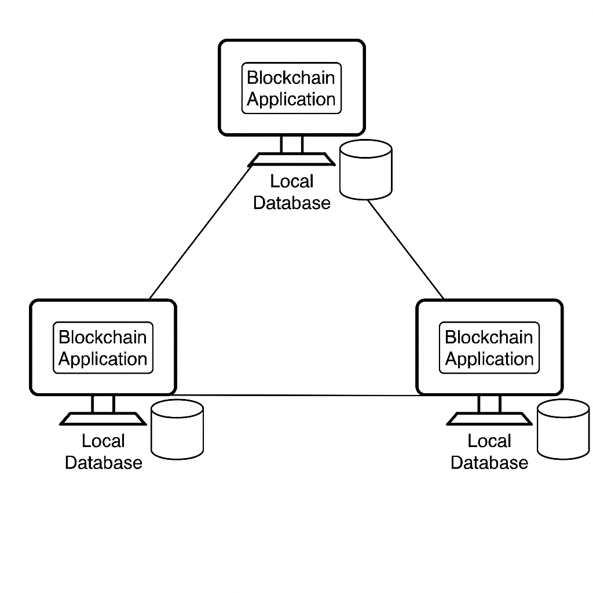

# Relatório do Trabalho M2: Consistência em Blockchain P2P

*Aluno: Luiz Felipe Cipriani Morfelle*

**Ciência da Computação**

## 1. Introdução e Objetivos

Este relatório documenta o desenvolvimento e análise de um sistema de blockchain peer-to-peer (P2P) simples, conforme proposto no enunciado do trabalho M2. O objetivo principal foi identificar e corrigir um problema de inconsistência de dados inerente a redes descentralizadas, especificamente um fork de blockchain resultante da mineração simultânea por diferentes nós.

Os objetivos específicos abordados incluem:

*   Analisar a implementação de uma blockchain básica e sua comunicação P2P.
*   Reproduzir um cenário de teste que demonstra a inconsistência da blockchain (fork).
*   Identificar a causa raiz do problema (fork acidental).
*   Pesquisar e discutir métodos comuns para resolução de forks em blockchains baseadas em Proof-of-Work (PoW).
*   Selecionar e implementar um mecanismo de consenso (Regra da Cadeia Mais Longa) para garantir a consistência.
*   Validar a solução implementada através da repetição do cenário de teste.
*   Documentar a arquitetura do sistema e do software.
*   Apresentar a solução de forma clara e estruturada neste relatório.

O trabalho utilizou um código base em Python fornecido, que simula operações de mineração, transação e comunicação entre nós em uma rede.


## 2. Configuração Inicial e Cenário de Teste

O enunciado solicitava a configuração de dois computadores em uma rede virtual privada (ZeroTier) executando a aplicação. 

O cenário de teste, foi seguido:

**Primeiro Passo (Sequencial - Comp1):**
1.  Computador 1 minera 2 blocos.
2.  Computador 1 transfere 10 moedas para Computador 2 (transação adicionada ao pool).
3.  Computador 1 minera 1 bloco (incluindo a transação).
4.  *Simulação:* O estado da blockchain do Comp1 é copiado para o Comp2 para sincronizar antes do próximo passo.

**Segundo Passo (Simulação Paralela):**
1.  Computador 1 minera 1 bloco (baseado no estado após o Passo 1).
2.  Computador 2 minera 1 bloco (baseado no estado após o Passo 1).

**Terceiro Passo (Verificação):**
1.  Verifica-se o estado da blockchain em ambos os computadores.


## 3. Resultados Iniciais (Inconsistência)

A primeira simulação, executada com o código original e dificuldade de mineração reduzida para 2 (para agilizar), reproduziu com sucesso a inconsistência esperada. Após o passo de mineração "paralela", os dois nós apresentaram cadeias de mesmo comprimento (5 blocos, incluindo o Gênesis), mas com hashes diferentes para o último bloco (índice 4).

**Saída do Comp1 (arquivo: `comp1_output.txt`):**
```
Index: 0, Hash: 0..., Tx: 0
Index: 1, Hash: 0007dd4e30..., Tx: 1
Index: 2, Hash: 0099ff23c1..., Tx: 1
Index: 3, Hash: 001d1e1d7d..., Tx: 2
Index: 4, Hash: 00f91fe283..., Tx: 1 
```

**Saída do Comp2 (arquivo: `comp2_output.txt`):**
```
Index: 0, Hash: 0..., Tx: 0
Index: 1, Hash: 0007dd4e30..., Tx: 1
Index: 2, Hash: 0099ff23c1..., Tx: 1
Index: 3, Hash: 001d1e1d7d..., Tx: 2
Index: 4, Hash: 00fbfe8a1c..., Tx: 1 
```

Observa-se que ambos os nós possuem blocos válidos até o índice 3 (com hash `001d1e1d7d...`). No entanto, o bloco de índice 4 minerado pelo Comp1 tem hash `00f91fe283...`, enquanto o bloco de índice 4 minerado pelo Comp2 tem hash `00fbfe8a1c...`. Isso configura um **fork** na blockchain, onde existem duas cadeias concorrentes e válidas (segundo as regras locais de cada nó naquele momento), mas incompatíveis entre si. Sem um mecanismo de consenso para resolver essa disputa, a rede permaneceria em estado inconsistente.


## 4. Análise da Causa do Erro

O erro observado é um **fork acidental temporário**. Este tipo de problema é comum em sistemas de blockchain descentralizados que utilizam mecanismos de consenso probabilísticos como o Proof-of-Work (PoW).

A causa raiz reside na latência da rede e na natureza distribuída do processo de mineração:

1.  **Mineração Concorrente:** Múltiplos nós (Comp1 e Comp2, no nosso cenário) podem encontrar uma solução válida para o desafio PoW (ou seja, minerar um novo bloco) quase simultaneamente.
2.  **Propagação na Rede:** Antes que o bloco minerado por um nó seja propagado e recebido por toda a rede, outro nó pode já ter minerado seu próprio bloco concorrente, ambos apontando para o mesmo bloco anterior (bloco 3, no nosso caso).
3.  **Validação Local:** Cada nó, ao receber um bloco, valida-o de acordo com as regras do protocolo (verificação do PoW, validade das transações, hash do bloco anterior). Ambos os blocos concorrentes (bloco 4 de Comp1 e bloco 4 de Comp2) são inicialmente considerados válidos pelos respectivos mineradores e pelos nós que os recebem primeiro.
4.  **Divergência:** Isso leva a uma situação onde diferentes partes da rede têm visões diferentes do estado mais recente da blockchain. Uma parte da rede pode ter a cadeia terminando com o bloco 4A (minerado por Comp1), enquanto outra parte tem a cadeia terminando com o bloco 4B (minerado por Comp2).

No código original fornecido, não havia um mecanismo explícito para resolver essa divergência. A função `handle_client` em `network.py` simplesmente verificava se o bloco recebido era válido e se seu `prev_hash` correspondia ao hash do último bloco local. Se dois blocos válidos para o mesmo índice fossem recebidos, o comportamento não era definido para escolher um deles ou resolver o conflito, levando à persistência da inconsistência observada na simulação inicial.

Este problema é fundamental em sistemas distribuídos que buscam consenso sem uma autoridade central. A solução requer um mecanismo que permita à rede convergir para uma única versão da história (a cadeia canônica).


## 5. Método de Solução Selecionado e Implementação

Para resolver o problema do fork acidental e garantir a consistência da blockchain entre os nós, foi selecionado o mecanismo de consenso mais comum para blockchains baseadas em PoW: a **Regra da Cadeia Mais Longa (Longest Chain Rule)**.

**Justificativa:**
*   **Compatibilidade:** É o mecanismo padrão para sistemas PoW como o Bitcoin e se integra naturalmente à lógica de mineração existente no código base.
*   **Simplicidade Conceitual:** A regra é relativamente simples de entender: a cadeia válida é aquela que representa o maior esforço computacional acumulado (que, com dificuldade constante, equivale à cadeia com mais blocos).
*   **Efetividade Comprovada:** É um mecanismo robusto e amplamente testado para alcançar consenso eventual em redes descentralizadas.

**Implementação:**

A implementação envolveu modificar a forma como os nós se comunicam e decidem qual versão da blockchain aceitar. As principais alterações foram realizadas nos arquivos `network.py` e `chain.py`:

1.  **Transmissão da Cadeia Completa:** Em vez de transmitir apenas o bloco recém-minerado (como na função `broadcast_block` original), a função `mine_block` (em `chain.py`) foi modificada para chamar uma nova função `broadcast_chain` (em `network.py`). Esta nova função serializa e transmite a *cadeia completa* do nó minerador para seus pares sempre que um novo bloco é minerado.

2.  **Recepção e Validação da Cadeia:** A função `handle_client` (em `network.py`) foi significativamente alterada para lidar com mensagens do tipo `full_chain`. Ao receber uma cadeia completa de outro nó:
    *   A cadeia recebida é desserializada.
    *   Sua validade é verificada usando uma função `is_chain_valid` aprimorada, que checa a ligação dos hashes, a validade do PoW de cada bloco e a integridade do hash de cada bloco.
    *   Se a cadeia recebida for válida **e** mais longa que a cadeia local atual do nó receptor, a cadeia local é **substituída** pela cadeia recebida.
    *   A nova cadeia canônica é salva no arquivo `blockchain.json`.

3.  **Validação Aprimorada (`is_chain_valid`):** Uma função robusta para validar toda a cadeia recebida foi implementada em `network.py`, garantindo que apenas cadeias válidas e mais longas substituam a cadeia local.

4.  **Transmissão de Transações:** A lógica de transmissão de transações (`broadcast_transaction`) foi mantida, mas ajustada para usar a lista de peers corretamente e incluir timeouts para evitar bloqueios indefinidos.

Essas alterações garantem que, mesmo que ocorra um fork temporário (dois nós mineram blocos concorrentes), a rede eventualmente convergirá para a cadeia mais longa assim que um nó conseguir minerar um bloco adicional sobre uma das ramificações do fork e transmitir sua cadeia agora mais longa.


## 6. Novos Resultados (Consistência Restaurada)

Após implementar a Regra da Cadeia Mais Longa, o cenário de teste foi executado novamente.

A simulação demonstrou que o mecanismo de consenso funcionou como esperado:

1.  **Fork Inicial:** Assim como na primeira simulação, após o passo de mineração "paralela", Comp1 e Comp2 criaram blocos de índice 4 diferentes, resultando em um fork temporário.
2.  **Mineração Adicional:** O script simulou Comp1 minerando um bloco adicional (índice 5) sobre sua versão da cadeia, tornando-a mais longa (6 blocos no total).
3.  **Transmissão da Cadeia Longa:** Comp1 transmitiu sua cadeia de 6 blocos para Comp2.
4.  **Resolução do Fork:** Comp2 recebeu a cadeia de Comp1, validou-a e, por ser mais longa que sua própria cadeia de 5 blocos (que terminava no seu bloco 4 concorrente), Comp2 descartou sua ramificação do fork e adotou a cadeia de Comp1 como a cadeia canônica.

**Resultados Finais:**
Ao final da simulação, ambos os nós convergiram para **exatamente a mesma cadeia**, que incluía o bloco 5 minerado por Comp1, resolvendo a inconsistência.

**Saída Final do Comp1 (arquivo: `comp1_output_fixed.txt`):**
```
# Final Comp1 Chain State (Node: comp1) after fix
--- Current Blockchain State ---
  Index: 0, Hash: 0..., PrevHash: 0..., Nonce: 0, Tx: 0
  Index: 1, Hash: 00331febac..., PrevHash: 0..., Nonce: 616, Tx: 1
  Index: 2, Hash: 003e2edfb9..., PrevHash: 00331febac..., Nonce: 196, Tx: 1
  Index: 3, Hash: 0079ec5dae..., PrevHash: 003e2edfb9..., Nonce: 178, Tx: 2
  Index: 4, Hash: 009fe0b396..., PrevHash: 0079ec5dae..., Nonce: 172, Tx: 1
  Index: 5, Hash: 00766dbc72..., PrevHash: 009fe0b396..., Nonce: 152, Tx: 1
------------------------------
```

**Saída Final do Comp2 (arquivo: `comp2_output_fixed.txt`):**
```
# Final Comp2 Chain State (Node: comp2) after fix
--- Current Blockchain State ---
  Index: 0, Hash: 0..., PrevHash: 0..., Nonce: 0, Tx: 0
  Index: 1, Hash: 00331febac..., PrevHash: 0..., Nonce: 616, Tx: 1
  Index: 2, Hash: 003e2edfb9..., PrevHash: 00331febac..., Nonce: 196, Tx: 1
  Index: 3, Hash: 0079ec5dae..., PrevHash: 003e2edfb9..., Nonce: 178, Tx: 2
  Index: 4, Hash: 009fe0b396..., PrevHash: 0079ec5dae..., Nonce: 172, Tx: 1
  Index: 5, Hash: 00766dbc72..., PrevHash: 009fe0b396..., Nonce: 152, Tx: 1
------------------------------
```

Como as saídas finais são idênticas, a simulação valida que a implementação da Regra da Cadeia Mais Longa foi eficaz em resolver o problema de inconsistência causado por forks acidentais na rede P2P simulada.


## 7. Arquitetura da Solução

**Arquitetura do Sistema (Conceitual):**

*   Representa os nós (computadores) interconectados em uma rede P2P (idealmente via ZeroTier, como sugerido, ou em uma LAN/simulação local).
*   Cada nó executa a mesma aplicação blockchain.
*   A comunicação ocorre diretamente entre os pares para transmitir transações e cadeias de blocos.


**Arquitetura do Software (Componentes Principais):**

*   **`main.py`:** Ponto de entrada, interface de linha de comando (CLI), inicialização da configuração, blockchain e servidor de rede.
*   **`block.py`:** Define a classe `Block` (estrutura de dados do bloco) e funções para criar/hashear blocos (incluindo o Gênesis e a lógica PoW em `create_block`).
*   **`chain.py`:** Gerencia a lista de blocos (a blockchain), carrega/salva a cadeia do/para arquivo (`load_chain`, `save_chain`), coordena a mineração (`mine_block`) e criação/transmissão de transações (`make_transaction`), calcula saldos (`get_balance`). Modificado para usar `broadcast_chain`.
*   **`network.py`:** Lida com a comunicação P2P. Inicia um servidor (`start_server`) para ouvir conexões de outros nós. Processa mensagens recebidas (`handle_client`) para blocos (agora cadeias completas) e transações. Implementa a lógica de validação da cadeia (`is_chain_valid`) e a Regra da Cadeia Mais Longa ao receber `full_chain`. Contém funções para transmitir mensagens (`broadcast_chain`, `broadcast_transaction`).
*   **`utils.py`:** Funções utilitárias, como carregar a configuração (`load_config`).


## 8. Conclusão

Este trabalho demonstrou com sucesso a ocorrência de forks acidentais em uma implementação básica de blockchain P2P e a eficácia da Regra da Cadeia Mais Longa como mecanismo de consenso para resolver tais inconsistências. A simulação inicial, utilizando o código original, evidenciou como a mineração concorrente pode levar a diferentes visões da blockchain entre os nós. A análise subsequente identificou a falta de um mecanismo de resolução de conflitos como a causa raiz.

A implementação da Regra da Cadeia Mais Longa, que envolve a transmissão da cadeia completa e a adoção da cadeia válida mais longa recebida, provou ser uma solução robusta no cenário simulado. A segunda simulação, com o código modificado, mostrou claramente a convergência da rede para um estado único e consistente da blockchain, mesmo após a ocorrência de um fork temporário.

O trabalho cumpriu os objetivos propostos, proporcionando uma compreensão prática dos desafios de consistência em sistemas descentralizados e da importância dos mecanismos de consenso. A solução implementada, embora simples, reflete o princípio fundamental utilizado em muitas blockchains reais baseadas em PoW.

## 9. Links 

*   **Link para o Repositório GitHub:** [https://github.com/luizmorfelle/blockchain]

## 10. Referências

*   Fork (blockchain) - Wikipedia: [https://en.wikipedia.org/wiki/Fork_(blockchain)](https://en.wikipedia.org/wiki/Fork_(blockchain))
*   Antonopoulos, Andreas M. *Mastering Bitcoin: Programming the Open Blockchain*. O'Reilly Media, 2017. (Conceitos gerais de blockchain e PoW)

